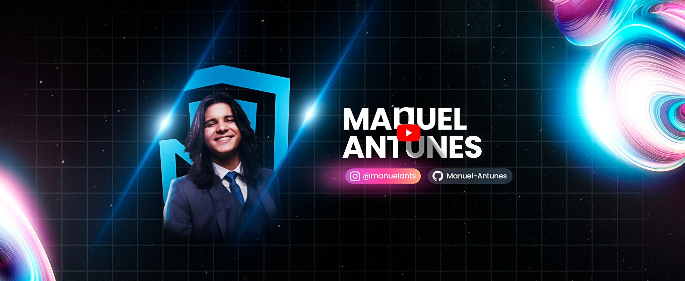

My name is Manuel Antunes. CEO at Lisbom, Senior Full stack developer, GameDeveloper, and Digital Marketing Dev. 

  

 

#### 😎 Skills

 

#### 📚 Learning:

 

#### 📊 Statistics to Nerds:

 

   
   
   
   
   

#### 🎓 Education:
- Técnico em Informática - Insituto Federal de Alagoas - Campus Arapiraca (2018 - Now...) ⌛

### ⚡ Fun fact: 
- despite programming a lot for the web my main lang is C ++ but my projects haven't come here yet

<!--
**Manuel-Antunes/Manuel-Antunes** is a ✨ _special_ ✨ repository because its `README.md` (this file) appears on your GitHub profile.

Here are some ideas to get you started:

- 🔭 I’m currently working on ...
- 🌱 I’m currently learning ...
- 👯 I’m looking to collaborate on ...
- 🤔 I’m looking for help with ...
- 💬 Ask me about ...
- 📫 How to reach me: ...
- 😄 Pronouns: ...
- ⚡ Fun fact: ...
-->
